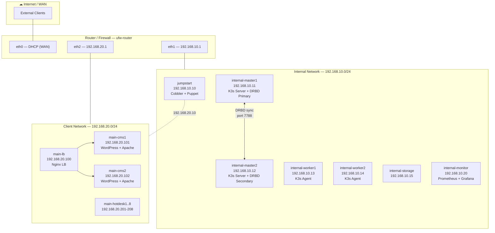

# CMS High-Availability Infrastructure — Fully Automated Deployment

<div align="center">

[](docs/SOFTWARE_BASELINE.md)
[]()
[](terraform/)
[](.github/workflows/ci.yml)
[]()

**Production-grade, zero-touch infrastructure for a high-availability Content Management System.**  
*14+ VMs · 2 segmented networks · 11 deployment phases · fully idempotent*

</div>

---

## Overview

This project implements the **complete design, provisioning, and automation** of a high-availability IT infrastructure running a WordPress CMS — from bare-metal OS installation to full-stack observability.

The entire environment is deployed with a **single command** (`./deploy_all.sh`), requiring zero manual intervention across 14+ virtual machines, 2 isolated network segments, and 11 orchestrated deployment phases.

### Key Technical Highlights

| Area | Implementation |
|:-----|:---------------|
| **Zero-touch Provisioning** | Cobbler PXE server + Ubuntu autoinstall for unattended OS deployment |
| **Idempotent Configuration** | Puppet 8 agent/server model with role-based manifests |
| **HA Clustering** | K3s (lightweight Kubernetes) with 2 server nodes + 2 agent nodes |
| **Synchronous Block Replication** | DRBD 9 Protocol C between master nodes for zero data loss |
| **Automated Failover** | DRBD promotion scripts + Kubernetes pod migration + chaos testing |
| **Load Balancing** | Nginx reverse proxy with health checks across 2 WordPress frontends |
| **Full-stack Observability** | Prometheus + Grafana + Alertmanager with 10 alert rules |
| **Defense in Depth** | UFW perimeter firewall + per-node iptables rules + network segmentation |
| **Internal PKI** | Private Certificate Authority (step-ca) with automated TLS renewal |
| **Infrastructure as Code** | Terraform/OpenTofu alternative for declarative VM provisioning |
| **Automated Backups** | Kubernetes CronJob for daily MariaDB dumps with 7-day rotation |
| **CI/CD Pipeline** | GitHub Actions: ShellCheck, yamllint, kubeconform, puppet-lint, terraform validate |

> **Verified deployment** — The full infrastructure was deployed and validated end-to-end on a remote bare-metal Linux server (27 GB RAM, KVM), confirming correct operation of all services: PXE provisioning, Puppet convergence, K3s HA cluster, WordPress reachability via HTTPS, DRBD replication, and Prometheus metrics collection.

---

## Architecture

The network is segmented into **two isolated subnets** connected by a UFW router/firewall:

| Network | CIDR | Purpose |
|:--------|:-----|:--------|
| **internal** | `192.168.10.0/24` | K3s cluster, MariaDB, DRBD replication, monitoring, provisioning |
| **main** | `192.168.20.0/24` | Load balancer, CMS frontends (WordPress), hot-desk workstations |



> For detailed topology, service, and deployment sequence diagrams see [`docs/NETWORK_DIAGRAM.md`](docs/NETWORK_DIAGRAM.md).

---

## Technology Stack

| Component | Technology | Version | Purpose |
|:----------|:-----------|:--------|:--------|
| Operating System | Ubuntu Server | 24.04 LTS | Base OS for all nodes |
| Bare-metal Provisioning | Cobbler | 3.3.x | PXE + autoinstall for unattended deployment |
| Configuration Management | Puppet | 8.x | Declarative, agent-based configuration |
| Container Orchestration | K3s | v1.29.x | Lightweight Kubernetes for HA clustering |
| Database | MariaDB | 10.11.x | StatefulSet inside K3s cluster |
| CMS | WordPress | 6.x | Content Management System |
| Web Server | Apache | 2.4.x | CMS frontend server with PHP 8.3 |
| Load Balancer | Nginx | 1.24.x | Reverse proxy with upstream health checks |
| Block Replication | DRBD | 9.x | Synchronous Protocol C replication |
| Metrics Collection | Prometheus | 2.x | Time-series monitoring with exporters |
| Alerting | Alertmanager | 0.27.x | Alert routing, grouping, and webhook delivery |
| Dashboards | Grafana | 11.x | Metrics visualisation and dashboards |
| Firewall | UFW | — | Perimeter and per-node iptables rules |
| PKI / TLS | step-ca | 0.27.x | Internal Certificate Authority |
| IaC (alternative) | Terraform | 1.x | Declarative VM provisioning |
| Virtualisation | KVM / QEMU / libvirt | — | Hypervisor and VM management |

> Full software inventory with versions, dependencies, and download URLs: [`docs/SOFTWARE_BASELINE.md`](docs/SOFTWARE_BASELINE.md)

---

## Repository Structure

```
CMS-HA-Infrastructure/
├── README.md                        # This file
├── deploy_all.sh                    # Main deployment orchestrator (single entry point)
│
├── docs/
│   ├── PLAN.md                      # Architecture plan and node inventory
│   ├── MANUAL.md                    # Operations manual — deployment, recovery, scaling
│   ├── SOFTWARE_BASELINE.md         # Software inventory with versions and URLs
│   ├── NETWORK_DIAGRAM.md           # Network diagrams (Mermaid)
│   └── phases/                      # Per-phase technical documentation (PHASE-00..11)
│
├── scripts/
│   ├── config.sh                    # Central configuration (IPs, credentials, SSH)
│   ├── 00_init_vms.sh               # VM and virtual network creation (libvirt)
│   ├── 01_setup_cobbler.sh          # Cobbler PXE/DHCP/DNS provisioning server
│   ├── 02_register_cobbler_nodes.sh # Register client nodes in Cobbler
│   ├── 03_repair_ssh_puppet.sh      # SSH and Puppet CA repair
│   ├── 04_setup_puppet.sh           # Puppet Server + Agent deployment
│   ├── 05_setup_drbd.sh             # DRBD block replication setup
│   ├── 06_setup_kubernetes.sh       # K3s HA cluster + MariaDB StatefulSet
│   ├── 07_setup_nginx_wordpress.sh  # Nginx LB + WordPress/Apache frontends
│   ├── 08_setup_monitoring.sh       # Prometheus + Grafana + exporters
│   ├── 09_setup_ufw.sh              # UFW perimeter and per-node firewall
│   ├── 10_setup_internal_ca.sh      # Internal CA (step-ca) deployment
│   ├── 11_traffic_mix.sh            # Load generation and E2E testing
│   └── utils/
│       ├── test_failover.sh         # Automated chaos engineering tests
│       ├── verify_all.sh            # Full infrastructure health check
│       └── ...                      # Maintenance and repair utilities
│
├── kubernetes/                      # K3s manifests (StatefulSet, CronJob, PV/PVC)
│   ├── mariadb-statefulset.yaml     # MariaDB with DRBD-backed persistent storage
│   ├── mariadb-backup-cronjob.yaml  # Automated daily backup with rotation
│   └── ...
│
├── puppet/                          # Puppet manifests and modules (role-based)
│
├── templates/                       # Configuration templates (envsubst-ready)
│   ├── cobbler/                     # DHCP, DNS, autoinstall templates
│   ├── drbd/                        # DRBD resource definition + failover script
│   ├── monitoring/                  # Prometheus, Alertmanager, Grafana configs
│   ├── nginx/                       # Upstream and SSL configuration
│   ├── pki/                         # step-ca configuration template
│   └── ...
│
├── terraform/                       # Declarative IaC alternative (dmacvicar/libvirt)
│   ├── main.tf                      # Networks, volumes, and VM definitions
│   ├── variables.tf                 # Configurable parameters
│   └── README.md                    # Usage instructions
│
└── .github/workflows/ci.yml        # CI pipeline (ShellCheck, kubeconform, terraform)
```

---

## Quick Start

### Prerequisites

- Linux host with **KVM/QEMU** and **libvirt** installed
- At least **16 GB RAM** (27 GB recommended for full deployment)
- Ubuntu 24.04 Server ISO
- SSH key pair for cluster management

### Deployment

```bash
git clone https://github.com/Aitor42/CMS-HA-Infrastructure.git
cd CMS-HA-Infrastructure

# Configure paths and credentials
export VM_DIR="$HOME/vm_storage"
export LIBVIRT_DEFAULT_URI=qemu:///system

# Full deployment (PXE provisioning + all phases)
./deploy_all.sh

# Or resume with pre-installed VMs (phases 01-08 only)
./deploy_all.sh --skip-vm-create
```

The orchestrator executes all phases sequentially: Cobbler → Puppet → DRBD → K3s → WordPress → Nginx → Monitoring → UFW → Internal CA.

### Terraform Alternative

```bash
cd terraform/
terraform init && terraform apply -var="vm_storage_path=$HOME/vm_storage"
cd .. && ./deploy_all.sh --skip-vm-create
```

---

## Deployment Phases

| Phase | Script | Description |
|:-----:|:-------|:------------|
| **00** | `00_init_vms.sh` | Virtual network and VM creation (libvirt/KVM) |
| **01** | `01_setup_cobbler.sh` | Cobbler PXE server — zero-touch OS provisioning |
| **02** | `04_setup_puppet.sh` | Puppet Server + Agent — idempotent configuration |
| **03** | `05_setup_drbd.sh` | DRBD 9 — synchronous block replication |
| **04** | `06_setup_kubernetes.sh` | K3s HA cluster + MariaDB StatefulSet |
| **05** | `07_setup_nginx_wordpress.sh` | Nginx load balancer + WordPress/Apache frontends |
| **06** | `08_setup_monitoring.sh` | Prometheus + Grafana + Alertmanager |
| **07** | `09_setup_ufw.sh` | UFW perimeter and per-node firewalling |
| **08** | `10_setup_internal_ca.sh` | Internal PKI — TLS certificates with step-ca |

---

## Observability

| Service | URL | Purpose |
|:--------|:----|:--------|
| Prometheus | `http://192.168.10.20:9090` | Metrics collection and alerting engine |
| Grafana | `http://192.168.10.20:3000` | Dashboards and visualisation |
| Alertmanager | `http://192.168.10.20:9093` | Alert routing and notification |

### Alert Rules

10 preconfigured alerts covering infrastructure and service health:

| Alert | Severity | Trigger |
|:------|:---------|:--------|
| NodeDown | critical | Node unreachable > 2 min |
| DiskSpaceCritical | critical | Filesystem > 90% full |
| MariaDBDown | critical | Database unreachable > 1 min |
| K3sNodeNotReady | critical | Kubernetes node not ready > 3 min |
| NginxDown | critical | Load balancer unreachable > 1 min |
| HighHTTP5xxRate | warning | Error rate > 5% over 5 min |

---

## Chaos Engineering

Automated failover tests validate the HA design under real failure conditions:

```bash
bash scripts/utils/test_failover.sh
```

| Test | Simulated Failure | Validated Behaviour |
|:-----|:------------------|:-------------------|
| DRBD Master Failover | Primary master node shutdown | Secondary promotes, MariaDB pod migrates, CMS stays online |
| CMS Frontend Failover | WordPress node shutdown | Nginx routes traffic to surviving frontend |
| K3s Worker Failover | Worker node shutdown | Pods reschedule to remaining worker |

---

## Documentation

| Document | Description |
|:---------|:------------|
| [PLAN.md](docs/PLAN.md) | Architecture plan, node inventory, and design decisions |
| [MANUAL.md](docs/MANUAL.md) | Operations manual — deployment, scaling, failover, troubleshooting |
| [SOFTWARE_BASELINE.md](docs/SOFTWARE_BASELINE.md) | Complete software inventory with versions and URLs |
| [NETWORK_DIAGRAM.md](docs/NETWORK_DIAGRAM.md) | Network topology and service architecture diagrams |
| [phases/](docs/phases/) | Per-phase technical documentation |

---

## CI Pipeline

The GitHub Actions CI validates every push and pull request:

| Job | Tool | Scope |
|:----|:-----|:------|
| Shell Lint | ShellCheck + `bash -n` | All `.sh` scripts |
| YAML Lint | yamllint | Kubernetes manifests, monitoring configs |
| K8s Validation | kubeconform | Kubernetes manifests against v1.29 schemas |
| Puppet Lint | puppet-lint | All `.pp` manifests |
| Python Lint | flake8 | Python utility scripts |
| Terraform Validate | `terraform fmt` + `validate` | IaC configuration |

---

## License

This project is licensed under the MIT License.
