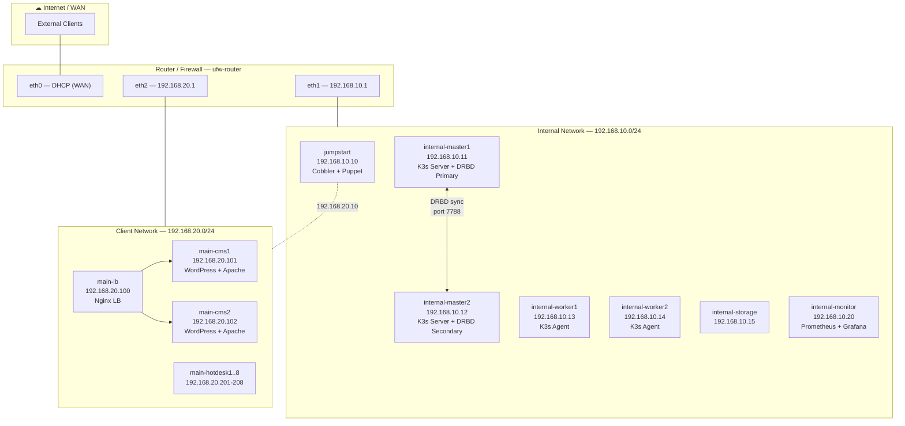

# CMS High-Availability Infrastructure — Fully Automated Deployment

<div align="center">

[](docs/SOFTWARE_BASELINE.md)
[]()
[](cmd/cms-ha/)
[](terraform/)
[](.github/workflows/ci.yml)
[]()

**Production-grade, zero-touch infrastructure for a high-availability Content Management System.**  
*14+ VMs · 2 segmented networks · 11 deployment phases · single Go binary · fully idempotent*

</div>

---

## Overview

This project implements the **complete design, provisioning, and automation** of a high-availability IT infrastructure running a WordPress CMS — from bare-metal OS installation to full-stack observability.

The entire environment is deployed with a **single command** (`cms-ha deploy`), requiring zero manual intervention across 14+ virtual machines, 2 isolated network segments, and 11 orchestrated deployment phases.

> **v2 — Go CLI rewrite**: The infrastructure orchestration has been rewritten from Bash scripts into a single, statically compiled Go binary (`cms-ha`). This provides type-safe configuration, SSH connection pooling, parallel operations, `age`-based secret encryption, and structured logging. The original shell scripts (v1) are preserved in the [`v1.0.0`](https://github.com/Aitor42/CMS-HA-Infrastructure/tree/v1.0.0) tag.

### Key Technical Highlights

| Area | Implementation |
|:-----|:---------------|
| **Zero-touch Provisioning** | Cobbler PXE server + Ubuntu autoinstall for unattended OS deployment |
| **Idempotent Configuration** | Puppet 8 agent/server model with role-based manifests |
| **HA Clustering** | K3s (lightweight Kubernetes) with 2 server nodes + 2 agent nodes |
| **Synchronous Block Replication** | DRBD 9 Protocol C between master nodes for zero data loss |
| **Automated Failover** | DRBD promotion scripts + Kubernetes pod migration + chaos testing |
| **Load Balancing** | Nginx reverse proxy with health checks across 2 WordPress frontends |
| **Full-stack Observability** | Prometheus + Grafana + Alertmanager with 10 alert rules |
| **Defense in Depth** | UFW perimeter firewall + per-node iptables rules + network segmentation |
| **Internal PKI** | Private Certificate Authority (step-ca) with automated TLS renewal |
| **Infrastructure as Code** | Terraform/OpenTofu alternative for declarative VM provisioning |
| **Automated Backups** | Kubernetes CronJob for daily MariaDB dumps with 7-day rotation |
| **CI/CD Pipeline** | GitHub Actions: ShellCheck, yamllint, kubeconform, puppet-lint, terraform validate |

> **Verified deployment** — The full infrastructure was deployed and validated end-to-end on a remote bare-metal Linux server (27 GB RAM, KVM), confirming correct operation of all services: PXE provisioning, Puppet convergence, K3s HA cluster, WordPress reachability via HTTPS, DRBD replication, and Prometheus metrics collection.

---

## Architecture

The network is segmented into **two isolated subnets** connected by a UFW router/firewall:

| Network | CIDR | Purpose |
|:--------|:-----|:--------|
| **internal** | `192.168.10.0/24` | K3s cluster, MariaDB, DRBD replication, monitoring, provisioning |
| **main** | `192.168.20.0/24` | Load balancer, CMS frontends (WordPress), hot-desk workstations |


```mermaid
graph TB
    subgraph WAN["☁ Internet / WAN"]
        INET["External Clients"]
    end

    subgraph ROUTER["Router / Firewall — ufw-router"]
        R_ETH0["eth0 — DHCP (WAN)"]
        R_ETH1["eth1 — 192.168.10.1"]
        R_ETH2["eth2 — 192.168.20.1"]
    end

    subgraph INTERNAL["Internal Network — 192.168.10.0/24"]
        JS["jumpstart<br/>192.168.10.10<br/>Cobbler + Puppet"]
        M1["internal-master1<br/>192.168.10.11<br/>K3s Server + DRBD Primary"]
        M2["internal-master2<br/>192.168.10.12<br/>K3s Server + DRBD Secondary"]
        W1["internal-worker1<br/>192.168.10.13<br/>K3s Agent"]
        W2["internal-worker2<br/>192.168.10.14<br/>K3s Agent"]
        ST["internal-storage<br/>192.168.10.15"]
        MON["internal-monitor<br/>192.168.10.20<br/>Prometheus + Grafana"]
    end

    subgraph MAIN["Client Network — 192.168.20.0/24"]
        LB["main-lb<br/>192.168.20.100<br/>Nginx LB"]
        CMS1["main-cms1<br/>192.168.20.101<br/>WordPress + Apache"]
        CMS2["main-cms2<br/>192.168.20.102<br/>WordPress + Apache"]
        HD["main-hotdesk1..8<br/>192.168.20.201-208"]
    end

    INET --- R_ETH0
    R_ETH1 --- INTERNAL
    R_ETH2 --- MAIN
    JS -.- |"192.168.20.10"| MAIN

    M1 <--> |"DRBD sync<br/>port 7788"| M2
    LB --> CMS1
    LB --> CMS2
```

> For detailed topology, service, and deployment sequence diagrams see [`docs/NETWORK_DIAGRAM.md`](docs/NETWORK_DIAGRAM.md).

---

## Technology Stack

| Component | Technology | Version | Purpose |
|:----------|:-----------|:--------|:--------|
| Operating System | Ubuntu Server | 24.04 LTS | Base OS for all nodes |
| Bare-metal Provisioning | Cobbler | 3.3.x | PXE + autoinstall for unattended deployment |
| Configuration Management | Puppet | 8.x | Declarative, agent-based configuration |
| Container Orchestration | K3s | v1.29.x | Lightweight Kubernetes for HA clustering |
| Database | MariaDB | 10.11.x | StatefulSet inside K3s cluster |
| CMS | WordPress | 6.x | Content Management System |
| Web Server | Apache | 2.4.x | CMS frontend server with PHP 8.3 |
| Load Balancer | Nginx | 1.24.x | Reverse proxy with upstream health checks |
| Block Replication | DRBD | 9.x | Synchronous Protocol C replication |
| Metrics Collection | Prometheus | 2.x | Time-series monitoring with exporters |
| Alerting | Alertmanager | 0.27.x | Alert routing, grouping, and webhook delivery |
| Dashboards | Grafana | 11.x | Metrics visualisation and dashboards |
| Firewall | UFW | — | Perimeter and per-node iptables rules |
| PKI / TLS | step-ca | 0.27.x | Internal Certificate Authority |
| IaC (alternative) | Terraform | 1.x | Declarative VM provisioning |
| Virtualisation | KVM / QEMU / libvirt | — | Hypervisor and VM management |

> Full software inventory with versions, dependencies, and download URLs: [`docs/SOFTWARE_BASELINE.md`](docs/SOFTWARE_BASELINE.md)

---

## Repository Structure

```
CMS-HA-Infrastructure/
├── README.md                        # This file
├── Makefile                         # Build, deploy, lint, and ops targets
├── config.yaml                      # Centralised typed configuration (age-encrypted secrets)
├── go.mod / go.sum                  # Go module definition
│
├── cmd/cms-ha/                      # CLI entry point (Cobra)
│   ├── main.go                      # Binary entry point
│   └── root/                        # Command definitions
│       ├── root.go                  # Root command + global flags (--config, --verbose, --dry-run)
│       ├── phase.go                 # cms-ha phase <name>  (all 11 phases)
│       ├── deploy.go                # cms-ha deploy        (full orchestration)
│       ├── vm.go                    # cms-ha vm <action>   (start, shrink, fix-boot-order, ...)
│       ├── verify.go                # cms-ha verify        (health check)
│       ├── test.go                  # cms-ha test failover (chaos engineering)
│       ├── traffic.go               # cms-ha traffic       (load testing)
│       ├── repair.go                # cms-ha repair k8s|clocks
│       ├── secrets.go               # cms-ha secrets encrypt|decrypt|generate-key
│       └── ...                      # backup, status, lint
│
├── internal/                        # Core Go packages (not importable externally)
│   ├── config/                      # Typed config loader (viper) + age encryption
│   ├── ssh/                         # SSH connection pool + SFTP + parallel execution
│   ├── libvirt/                     # virsh/virt-install/qemu-img wrapper
│   ├── logging/                     # Coloured structured logging (slog + fatih/color)
│   ├── retry/                       # Retry/poll primitives with context
│   ├── templates/                   # Go template renderer with embed.FS
│   ├── deploy/                      # Orchestrator — coordinates all phases
│   ├── lint/                        # External linter runner (shellcheck, yamllint, ...)
│   ├── utils/                       # VM ops, verify, failover, repair, status
│   └── phases/                      # Phase implementations (one package per phase)
│       ├── initvms/                 # 00 — VM creation (libvirt/cloud-init/PXE)
│       ├── cobbler/                 # 01 — Cobbler PXE server setup
│       ├── registernodes/           # 02 — Register nodes in Cobbler
│       ├── repairssh/               # 03 — SSH + Puppet CA repair
│       ├── puppet/                  # 04 — Puppet Server/Agent deployment
│       ├── drbd/                    # 05 — DRBD block replication
│       ├── kubernetes/              # 06 — K3s HA cluster + MariaDB
│       ├── nginx/                   # 07 — Nginx LB + WordPress frontends
│       ├── monitoring/              # 08 — Prometheus + Grafana
│       ├── ufw/                     # 09 — UFW perimeter firewall
│       ├── pki/                     # 10 — Internal CA (step-ca)
│       └── traffic/                 # 11 — Load testing
│
├── scripts/                         # Legacy shell scripts (v1, kept for reference)
├── kubernetes/                      # K3s manifests (StatefulSet, CronJob, PV/PVC)
├── puppet/                          # Puppet manifests and modules (role-based)
├── templates/                       # Configuration templates (Go text/template)
├── terraform/                       # Declarative IaC alternative (dmacvicar/libvirt)
└── .github/workflows/ci.yml        # CI: Go build + ShellCheck + kubeconform + puppet-lint
```

---

## Quick Start

### Prerequisites

- Linux host (AMD64) with **KVM/QEMU** and **libvirt** installed
- **Go 1.22+** (for building from source) or download the pre-built binary
- At least **16 GB RAM** (27 GB recommended for full deployment)
- Ubuntu 24.04 Server ISO
- SSH key pair for cluster management

### Build

```bash
git clone https://github.com/Aitor42/CMS-HA-Infrastructure.git
cd CMS-HA-Infrastructure

# Build the CLI binary
make build

# Or directly with Go
go build -o cms-ha ./cmd/cms-ha/
```

### Deployment

```bash
# Edit config.yaml to match your environment
vim config.yaml

# (Optional) Encrypt secrets in config.yaml
./cms-ha secrets generate-key
./cms-ha secrets encrypt --key public.key

# Full deployment (PXE provisioning + all phases)
./cms-ha deploy

# Or resume with pre-installed VMs
./cms-ha deploy --skip-vm-create

# Run a specific phase
./cms-ha phase setup-drbd

# Verbose output
./cms-ha -v deploy
```

The orchestrator executes all phases sequentially: VM Init → Cobbler → Puppet → DRBD → K3s → WordPress → Nginx → Monitoring → UFW → Internal CA.

### Terraform Alternative

```bash
cd terraform/
terraform init && terraform apply -var="vm_storage_path=$HOME/vm_storage"
cd .. && ./cms-ha deploy --skip-vm-create
```

---

## Deployment Phases

| Phase | CLI Command | Description |
|:-----:|:------------|:------------|
| **00** | `cms-ha phase init-vms` | Virtual network and VM creation (libvirt/KVM) |
| **01** | `cms-ha phase setup-cobbler` | Cobbler PXE server — zero-touch OS provisioning |
| **02** | `cms-ha phase register-nodes` | Register client nodes in Cobbler |
| **03** | `cms-ha phase repair-ssh` | SSH and Puppet CA repair |
| **04** | `cms-ha phase setup-puppet` | Puppet Server + Agent — idempotent configuration |
| **05** | `cms-ha phase setup-drbd` | DRBD 9 — synchronous block replication |
| **06** | `cms-ha phase setup-kubernetes` | K3s HA cluster + MariaDB StatefulSet |
| **07** | `cms-ha phase setup-nginx-wordpress` | Nginx load balancer + WordPress/Apache frontends |
| **08** | `cms-ha phase setup-monitoring` | Prometheus + Grafana + Alertmanager |
| **09** | `cms-ha phase setup-ufw` | UFW perimeter and per-node firewalling |
| **10** | `cms-ha phase setup-ca` | Internal PKI — TLS certificates with step-ca |

---

## Observability

| Service | URL | Purpose |
|:--------|:----|:--------|
| Prometheus | `http://192.168.10.20:9090` | Metrics collection and alerting engine |
| Grafana | `http://192.168.10.20:3000` | Dashboards and visualisation |
| Alertmanager | `http://192.168.10.20:9093` | Alert routing and notification |

### Alert Rules

10 preconfigured alerts covering infrastructure and service health:

| Alert | Severity | Trigger |
|:------|:---------|:--------|
| NodeDown | critical | Node unreachable > 2 min |
| DiskSpaceCritical | critical | Filesystem > 90% full |
| MariaDBDown | critical | Database unreachable > 1 min |
| K3sNodeNotReady | critical | Kubernetes node not ready > 3 min |
| NginxDown | critical | Load balancer unreachable > 1 min |
| HighHTTP5xxRate | warning | Error rate > 5% over 5 min |

---

## Chaos Engineering

Automated failover tests validate the HA design under real failure conditions:

```bash
./cms-ha test failover

# Inspect state without restoring
./cms-ha test failover --skip-restore
```

| Test | Simulated Failure | Validated Behaviour |
|:-----|:------------------|:-------------------|
| DRBD Master Failover | Primary master node shutdown | Secondary promotes, MariaDB pod migrates, CMS stays online |
| CMS Frontend Failover | WordPress node shutdown | Nginx routes traffic to surviving frontend |
| K3s Worker Failover | Worker node shutdown | Pods reschedule to remaining worker |

---

## Documentation

| Document | Description |
|:---------|:------------|
| [PLAN.md](docs/PLAN.md) | Architecture plan, node inventory, and design decisions |
| [MANUAL.md](docs/MANUAL.md) | Operations manual — deployment, scaling, failover, troubleshooting |
| [SOFTWARE_BASELINE.md](docs/SOFTWARE_BASELINE.md) | Complete software inventory with versions and URLs |
| [NETWORK_DIAGRAM.md](docs/NETWORK_DIAGRAM.md) | Network topology and service architecture diagrams |
| [phases/](docs/phases/) | Per-phase technical documentation |

---

## CI Pipeline

The GitHub Actions CI validates every push and pull request:

| Job | Tool | Scope |
|:----|:-----|:------|
| **Go Build & Test** | `go build` + `go vet` + `go test` | CLI binary compilation + unit tests |
| Shell Lint | ShellCheck + `bash -n` | All `.sh` scripts |
| YAML Lint | yamllint | Kubernetes manifests, monitoring configs |
| K8s Validation | kubeconform | Kubernetes manifests against v1.29 schemas |
| Puppet Lint | puppet-lint | All `.pp` manifests |
| Terraform Validate | `terraform fmt` + `validate` | IaC configuration |

---

## License

This project is licensed under the MIT License.
