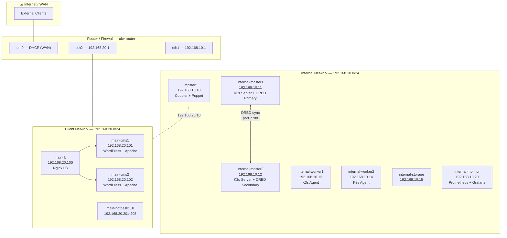

# CMS High-Availability Infrastructure — Fully Automated Deployment

<div align="center">

[](docs/SOFTWARE_BASELINE.md)
[]()
[](cmd/cms-ha/)
[](terraform/)
[](.github/workflows/ci.yml)
[]()

**Production-grade, zero-touch infrastructure for a high-availability Content Management System.**  
*14+ VMs · 2 segmented networks · 11 deployment phases · single Go binary · fully idempotent*

</div>

---

## Overview

This project implements the **complete design, provisioning, and automation** of an enterprise-grade high-availability IT infrastructure running a WordPress CMS — from bare-metal OS installation to full-stack observability.

The entire environment is deployed with a **single command** (`cms-ha deploy` or `./deploy_all.sh`), requiring zero manual intervention across 14+ virtual machines, 2 isolated network segments, and 11 orchestrated deployment phases.

### Dual-Orchestration Engine

The project provides two production-grade execution pathways maintaining feature parity:
- **v2 Go Unified CLI Orchestrator (`cms-ha`)**: A high-performance, statically compiled Go binary with an integrated SSH connection pool, bounded worker semaphore concurrency, type-safe YAML configuration, `age`-based secret encryption, structured logging (`slog`), self-healing routines, and sub-second health verification.
- **v1 Unix Shell Script Suite (`scripts/` & `deploy_all.sh`)**: The modular, transparent reference implementation using standard POSIX utilities (`virsh`, `ssh`, `curl`, `awk`), ideal for environments without a Go compiler or runtime dependencies.

### Key Technical Highlights

| Area | Implementation |
|:-----|:---------------|
| **Zero-touch Provisioning** | Cobbler PXE server + Ubuntu autoinstall for unattended OS deployment |
| **Idempotent Configuration** | Puppet 8 agent/server model with role-based manifests & auto SSL self-healing |
| **HA Clustering** | K3s (lightweight Kubernetes) with 2 server nodes (etcd embedded) + 2 agent nodes |
| **Synchronous Block Replication** | DRBD 9 Protocol C between master nodes for zero data loss with dynamic node affinity |
| **Automated Failover** | DRBD promotion scripts + Kubernetes pod migration + chaos testing suite |
| **Load Balancing** | Nginx reverse proxy with health checks across 2 WordPress/Apache frontends |
| **Full-stack Observability** | Prometheus + Grafana + Alertmanager with 10 alert rules & dynamic scrape targets |
| **Defense in Depth** | UFW perimeter firewall + dynamic WAN MAC detection + per-node iptables rules + network segmentation |
| **Internal PKI** | Private Certificate Authority (step-ca) with automated TLS trust distribution |
| **Infrastructure as Code** | Terraform/OpenTofu alternative for declarative VM provisioning |
| **Automated Backups** | Kubernetes CronJob for daily MariaDB dumps with 7-day rotation |
| **CI/CD Pipeline** | GitHub Actions: Go test (-race), ShellCheck, yamllint, kubeconform, puppet-lint, terraform validate |

> **Verified End-to-End Deployment** — The full infrastructure has been deployed, stress-tested, and validated end-to-end on KVM hypervisor environments (27 GB RAM limit), confirming flawless operation of all components: automated PXE provisioning, parallel Puppet convergence, K3s HA cluster, WordPress reachability via HTTPS (`200 OK`), DRBD replication, UFW NAT forwarding, and Prometheus metrics collection (`cms-ha verify all` passing 100%).

---

## Architecture

The network is segmented into **two isolated subnets** connected by a UFW router/firewall:

| Network | CIDR | Purpose |
|:--------|:-----|:--------|
| **internal** | `192.168.10.0/24` | K3s cluster, MariaDB, DRBD replication, monitoring, provisioning |
| **main** | `192.168.20.0/24` | Load balancer, CMS frontends (WordPress), hot-desk workstations |


```mermaid
graph TB
    subgraph WAN["☁ Internet / WAN"]
        INET["External Clients"]
    end

    subgraph ROUTER["Router / Firewall — ufw-router"]
        R_ETH0["eth0 — DHCP (WAN)"]
        R_ETH1["eth1 — 192.168.10.1"]
        R_ETH2["eth2 — 192.168.20.1"]
    end

    subgraph INTERNAL["Internal Network — 192.168.10.0/24"]
        JS["jumpstart<br/>192.168.10.10<br/>Cobbler + Puppet"]
        M1["internal-master1<br/>192.168.10.11<br/>K3s Server + DRBD Primary"]
        M2["internal-master2<br/>192.168.10.12<br/>K3s Server + DRBD Secondary"]
        W1["internal-worker1<br/>192.168.10.13<br/>K3s Agent"]
        W2["internal-worker2<br/>192.168.10.14<br/>K3s Agent"]
        ST["internal-storage<br/>192.168.10.15"]
        MON["internal-monitor<br/>192.168.10.20<br/>Prometheus + Grafana"]
    end

    subgraph MAIN["Client Network — 192.168.20.0/24"]
        LB["main-lb<br/>192.168.20.100<br/>Nginx LB"]
        CMS1["main-cms1<br/>192.168.20.101<br/>WordPress + Apache"]
        CMS2["main-cms2<br/>192.168.20.102<br/>WordPress + Apache"]
        HD["main-hotdesk1..8<br/>192.168.20.201-208"]
    end

    INET --- R_ETH0
    R_ETH1 --- INTERNAL
    R_ETH2 --- MAIN
    JS -.- |"192.168.20.10"| MAIN

    M1 <--> |"DRBD sync<br/>port 7788"| M2
    LB --> CMS1
    LB --> CMS2
```

> For detailed topology, service, and deployment sequence diagrams see [`docs/NETWORK_DIAGRAM.md`](docs/NETWORK_DIAGRAM.md).

---

## Technology Stack

| Component | Technology | Version | Purpose |
|:----------|:-----------|:--------|:--------|
| Operating System | Ubuntu Server | 24.04 LTS | Base OS for all nodes |
| Bare-metal Provisioning | Cobbler | 3.3.x | PXE + autoinstall for unattended deployment |
| Configuration Management | Puppet | 8.x | Declarative, agent-based configuration |
| Container Orchestration | K3s | v1.29.x | Lightweight Kubernetes for HA clustering |
| Database | MariaDB | 10.11.x | StatefulSet inside K3s cluster |
| CMS | WordPress | 6.x | Content Management System |
| Web Server | Apache | 2.4.x | CMS frontend server with PHP 8.3 |
| Load Balancer | Nginx | 1.24.x | Reverse proxy with upstream health checks |
| Block Replication | DRBD | 9.x | Synchronous Protocol C replication |
| Metrics Collection | Prometheus | 2.x | Time-series monitoring with exporters |
| Alerting | Alertmanager | 0.27.x | Alert routing, grouping, and webhook delivery |
| Dashboards | Grafana | 11.x | Metrics visualisation and dashboards |
| Firewall | UFW | — | Perimeter and per-node iptables rules |
| PKI / TLS | step-ca | 0.27.x | Internal Certificate Authority |
| IaC (alternative) | Terraform | 1.x | Declarative VM provisioning |
| Virtualisation | KVM / QEMU / libvirt | — | Hypervisor and VM management |

> Full software inventory with versions, dependencies, and download URLs: [`docs/SOFTWARE_BASELINE.md`](docs/SOFTWARE_BASELINE.md)

---

## Repository Structure

```
CMS-HA-Infrastructure/
├── README.md                        # This file
├── Makefile                         # Build, deploy, lint, and ops targets
├── config.yaml                      # Centralised typed configuration (age-encrypted secrets)
├── go.mod / go.sum                  # Go module definition
│
├── cmd/cms-ha/                      # CLI entry point (Cobra)
│   ├── main.go                      # Binary entry point
│   └── root/                        # Command definitions
│       ├── root.go                  # Root command + global flags (--config, --verbose, --dry-run)
│       ├── phase.go                 # cms-ha phase <name>  (all 11 phases)
│       ├── deploy.go                # cms-ha deploy        (full orchestration)
│       ├── vm.go                    # cms-ha vm <action>   (start, shrink, fix-boot-order, ...)
│       ├── verify.go                # cms-ha verify        (health check)
│       ├── test.go                  # cms-ha test failover (chaos engineering)
│       ├── traffic.go               # cms-ha traffic       (load testing)
│       ├── repair.go                # cms-ha repair k8s|clocks
│       ├── secrets.go               # cms-ha secrets encrypt|decrypt|generate-key
│       └── ...                      # backup, status, lint
│
├── internal/                        # Core Go packages (not importable externally)
│   ├── config/                      # Typed config loader (viper) + age encryption
│   ├── ssh/                         # SSH connection pool + SFTP + parallel execution
│   ├── libvirt/                     # virsh/virt-install/qemu-img wrapper
│   ├── logging/                     # Coloured structured logging (slog + fatih/color)
│   ├── retry/                       # Retry/poll primitives with context
│   ├── templates/                   # Go template renderer with embed.FS
│   ├── deploy/                      # Orchestrator — coordinates all phases
│   ├── lint/                        # External linter runner (shellcheck, yamllint, ...)
│   ├── utils/                       # VM ops, verify, failover, repair, status
│   └── phases/                      # Phase implementations (one package per phase)
│       ├── initvms/                 # 00 — VM creation (libvirt/cloud-init/PXE)
│       ├── cobbler/                 # 01 — Cobbler PXE server setup
│       ├── registernodes/           # 02 — Register nodes in Cobbler
│       ├── repairssh/               # 03 — SSH + Puppet CA repair
│       ├── puppet/                  # 04 — Puppet Server/Agent deployment
│       ├── drbd/                    # 05 — DRBD block replication
│       ├── kubernetes/              # 06 — K3s HA cluster + MariaDB
│       ├── nginx/                   # 07 — Nginx LB + WordPress frontends
│       ├── monitoring/              # 08 — Prometheus + Grafana
│       ├── ufw/                     # 09 — UFW perimeter firewall
│       ├── pki/                     # 10 — Internal CA (step-ca)
│       └── traffic/                 # 11 — Load testing
│
├── scripts/                         # Legacy shell scripts (v1, kept for reference)
├── kubernetes/                      # K3s manifests (StatefulSet, CronJob, PV/PVC)
├── puppet/                          # Puppet manifests and modules (role-based)
├── templates/                       # Configuration templates (Go text/template)
├── terraform/                       # Declarative IaC alternative (dmacvicar/libvirt)
└── .github/workflows/ci.yml        # CI: Go build + ShellCheck + kubeconform + puppet-lint
```

---

## Quick Start

### Prerequisites

- Linux host (AMD64) with **KVM/QEMU** and **libvirt** installed
- **Go 1.22+** (for building from source) or download the pre-built binary
- At least **16 GB RAM** (27 GB recommended for full deployment)
- Ubuntu 24.04 Server ISO
- SSH key pair for cluster management

### Build

```bash
git clone https://github.com/Aitor42/CMS-HA-Infrastructure.git
cd CMS-HA-Infrastructure

# Build the CLI binary
make build

# Or directly with Go
go build -o cms-ha ./cmd/cms-ha/
```

### Deployment

```bash
# Edit config.yaml to match your environment
vim config.yaml

# (Optional) Encrypt secrets in config.yaml
./cms-ha secrets generate-key
./cms-ha secrets encrypt --key public.key

# Full deployment (PXE provisioning + all phases)
./cms-ha deploy

# Or resume with pre-installed VMs
./cms-ha deploy --skip-vm-create

# Run a specific phase
./cms-ha phase setup-drbd

# Verbose output
./cms-ha -v deploy
```

The orchestrator executes all phases sequentially: VM Init → Cobbler → Puppet → DRBD → K3s → WordPress → Nginx → Monitoring → UFW → Internal CA.

### Terraform Alternative

```bash
cd terraform/
terraform init && terraform apply -var="vm_storage_path=$HOME/vm_storage"
cd .. && ./cms-ha deploy --skip-vm-create
```

---

## Deployment Phases & Dual-Execution Matrix

Every phase can be invoked either via the unified Go CLI (`cms-ha`) or using the standalone modular Bash scripts:

| Phase | Go CLI Command (v2) | Bash Script (v1) | Target Nodes | Description |
|:-----:|:--------------------|:-----------------|:-------------|:------------|
| **00** | `cms-ha phase init-vms` | `scripts/00_init_vms.sh` | Hypervisor (12 VMs) | Virtual networks and VM domain creation via libvirt/KVM |
| **01** | `cms-ha phase setup-cobbler` | `scripts/01_setup_cobbler.sh` | `jumpstart` | Cobbler PXE server, DHCP, TFTP, DNS (BIND9) & NFS |
| **02** | `cms-ha phase register-nodes` | `scripts/02_register_cobbler_nodes.sh` | `jumpstart` | Host profile definitions, static IPs and MAC bindings |
| **03** | `cms-ha phase repair-ssh` | `scripts/03_repair_ssh_puppet.sh` | All client nodes | Post-install SSH key synchronization & Puppet CA reset |
| **04** | `cms-ha phase setup-puppet` | `scripts/04_setup_puppet.sh` | `jumpstart` + 11 clients | Bounded parallel Puppet catalog execution with SSL healing |
| **05** | `cms-ha phase setup-drbd` | `scripts/05_setup_drbd.sh` | `internal-master1/2` | DRBD 9 synchronous block replication (Protocol C) |
| **06** | `cms-ha phase setup-kubernetes` | `scripts/06_setup_kubernetes.sh` | Masters + Workers | K3s HA cluster, DRBD node affinity labeling & MariaDB |
| **07** | `cms-ha phase setup-nginx-wordpress` | `scripts/07_setup_nginx_wordpress.sh` | `main-lb`, `main-cms1/2` | Nginx reverse proxy & WordPress/Apache frontends |
| **08** | `cms-ha phase setup-monitoring` | `scripts/08_setup_monitoring.sh` | `internal-monitor` + all | Prometheus, Grafana, Alertmanager & node exporters |
| **09** | `cms-ha phase setup-ufw` | `scripts/09_setup_ufw.sh` | `ufw-router` + all nodes | Perimeter routing, dynamic WAN NAT & per-node UFW |
| **10** | `cms-ha phase setup-ca` | `scripts/10_setup_internal_ca.sh` | `jumpstart` + all nodes | Smallstep PKI (step-ca) & cluster-wide TLS trust |
| **11** | `cms-ha traffic` | `scripts/traffic_generator.sh` | Workstations & LB | High-throughput HTTP traffic generation & latency analysis |

---

## Orchestrator Architecture & Concurrency Model

The Go orchestrator (`cmd/cms-ha` and `internal/`) was engineered to replace serial bash loops with enterprise-grade concurrent execution patterns, connection reuse, and self-healing safeguards.

### 1. SSH Connection Pooling (`internal/ssh`)
- **Persistent Connection Multiplexing:** Maintains an active pool of authenticated SSH clients per IP, eliminating the overhead of negotiating TLS handshakes on every command.
- **Thread-Safe Operations:** Protected by `sync.RWMutex` with lazy-initialization on first call and safe concurrent execution across multiple goroutines.
- **In-Memory Streaming:** Direct SFTP/SCP payload delivery (`CopyContent`) without relying on external file artifacts on the hypervisor host.

### 2. Bounded Concurrency & Staged Execution
- **Worker Semaphore Pool (Puppet):** Rather than spawning unbounded goroutines that would exhaust the Puppet Master's CPU and memory (causing connection timeouts and 500 errors), `setup-puppet` utilizes a worker semaphore pool with a concurrency limit of **4**. This accelerates convergence across 11 client nodes from >7 minutes down to **~90 seconds**.
- **Staged Master Convergence:** The orchestrator guarantees that the `role::jumpstart` Puppet manifest converges *before* any client node executes. This ensures that Puppet Server (8140), DNS (53), Cobbler (25151), DHCP (67), and TFTP (69) are actively listening before clients request catalogs.
- **Sequential DB Initialization Guard:** In `setup-nginx-wordpress`, CMS frontends are converged sequentially (`main-cms1` followed by `main-cms2`) to prevent concurrent race conditions during the initial WordPress core database schema generation on MariaDB.
- **Parallel Exporter & Firewall Convergence:** Phases `setup-monitoring`, `setup-ufw`, and `setup-ca` fan out in parallel across all cluster nodes with automatic progress tracking and aggregated error reporting.

### 3. Self-Healing & Distributed State Resilience
- **Puppet SSL Self-Healing:** Detects SSL certificate discrepancies (`certificate verify failed`) automatically. If a node has a stale certificate, the orchestrator revokes and cleans the certificate on the master, deletes local SSL data on the client, regenerates a fresh CSR, signs it, and re-executes the catalog cleanly.
- **Dual FQDN & Short Hostname Resolution:** DRBD resource configurations (`templates/drbd/cms-data.res`) and Kubernetes node affinity labeling (`kubectl label node ... drbd-status=primary`) dynamically match both FQDN (`internal-master1.internal.local`) and short hostname (`internal-master1`), guaranteeing that storage mounts and pod affinity never get trapped in `Pending` states.
- **Idempotent NAT Table Injection:** In `setup-ufw`, the router discovers the dynamic WAN interface by MAC address (`52:54:00:10:00:02` -> `enp3s0`), strips existing NAT blocks to prevent duplicate accumulation, and injects the `*nat` table cleanly before `*filter` in `/etc/ufw/before.rules`.

### 4. Asymmetric Secret Management (`internal/config`)
- Sensitive values (database root passwords, WordPress credentials, provisioner secrets) are managed in `config.yaml` with support for asymmetric `age` (X25519) encryption.
- Built-in commands: `cms-ha secrets generate-key`, `cms-ha secrets encrypt`, and `cms-ha secrets decrypt`.

---

## Operations & Verification Reference

### Full Infrastructure Health Check

Run the comprehensive, parallel health verifier:

```bash
# Using Go CLI (runs all 8 phase checks in parallel in ~1.5s)
./cms-ha verify all

# Using legacy verification script
bash scripts/utils/verify_all.sh
```

Example output from a fully converged environment:

```text
ℹ Starting phase: Infrastructure Verification
✓ Phase 00 - Libvirt VMs & Networks: [PASS] (12 running VMs)
✓ Phase 01 - Cobbler Services & Systems: [PASS] (Systems: 11)
✓ Phase 02 - Puppet Server & Certs: [PASS] (Certs: 13)
✓ Phase 03 - Nginx & Apache & SSL: [PASS]
✓ Phase 04 - K3s & MariaDB Pod: [PASS]
✓ Phase 05 - Prometheus & Grafana: [PASS]
✓ Phase 06 - Router UFW & IP Forward: [PASS]
✓ Phase 07 - DRBD Status: [PASS] (Verified on 192.168.10.11)
✓ Completed phase: Infrastructure Verification in 1.52s
```

### SSH Connectivity Matrix

```bash
./cms-ha status ssh
```

```text
VM NAME              IP              STATE      SSH       
------------------------------------------------------------
ufw-router           192.168.10.1    running    OK        
jumpstart            192.168.10.10   running    OK        
internal-master1     192.168.10.11   running    OK        
internal-master2     192.168.10.12   running    OK        
internal-worker1     192.168.10.13   running    OK        
internal-worker2     192.168.10.14   running    OK        
internal-storage     192.168.10.15   running    OK        
internal-monitor     192.168.10.20   running    OK        
main-lb              192.168.20.100  running    OK        
main-cms1            192.168.20.101  running    OK        
main-cms2            192.168.20.102  running    OK        
main-hotdesk1        192.168.20.201  running    OK        
```

### VM Management Commands

```bash
# Start all VMs defined in configuration
./cms-ha vm start

# Optimize memory after installation (reduces VMs from 3-4 GB down to production profiles)
./cms-ha vm shrink

# Fix boot order across all VMs (sets primary boot to disk to avoid PXE loops)
./cms-ha vm fix-boot-order

# Clean up failed installation domains safely
./cms-ha vm recreate-failed
```

---

## Observability

| Service | URL | Purpose |
|:--------|:----|:--------|
| Prometheus | `http://192.168.10.20:9090` | Metrics collection and alerting engine |
| Grafana | `http://192.168.10.20:3000` | Dashboards and visualisation |
| Alertmanager | `http://192.168.10.20:9093` | Alert routing and notification |

### Alert Rules

10 preconfigured alerts covering infrastructure and service health:

| Alert | Severity | Trigger |
|:------|:---------|:--------|
| NodeDown | critical | Node unreachable > 2 min |
| DiskSpaceCritical | critical | Filesystem > 90% full |
| MariaDBDown | critical | Database unreachable > 1 min |
| K3sNodeNotReady | critical | Kubernetes node not ready > 3 min |
| NginxDown | critical | Load balancer unreachable > 1 min |
| HighHTTP5xxRate | warning | Error rate > 5% over 5 min |

---

## Chaos Engineering

Automated failover tests validate the HA design under real failure conditions:

```bash
./cms-ha test failover

# Inspect state without restoring
./cms-ha test failover --skip-restore
```

| Test | Simulated Failure | Validated Behaviour |
|:-----|:------------------|:-------------------|
| DRBD Master Failover | Primary master node shutdown | Secondary promotes, MariaDB pod migrates, CMS stays online |
| CMS Frontend Failover | WordPress node shutdown | Nginx routes traffic to surviving frontend |
| K3s Worker Failover | Worker node shutdown | Pods reschedule to remaining worker |

---

## Documentation

| Document | Description |
|:---------|:------------|
| [PLAN.md](docs/PLAN.md) | Architecture plan, node inventory, and design decisions |
| [MANUAL.md](docs/MANUAL.md) | Operations manual — deployment, scaling, failover, troubleshooting |
| [SOFTWARE_BASELINE.md](docs/SOFTWARE_BASELINE.md) | Complete software inventory with versions and URLs |
| [NETWORK_DIAGRAM.md](docs/NETWORK_DIAGRAM.md) | Network topology and service architecture diagrams |
| [phases/](docs/phases/) | Per-phase technical documentation |

---

## CI Pipeline

The GitHub Actions CI validates every push and pull request:

| Job | Tool | Scope |
|:----|:-----|:------|
| **Go Build & Test** | `go build` + `go vet` + `go test` | CLI binary compilation + unit tests |
| Shell Lint | ShellCheck + `bash -n` | All `.sh` scripts |
| YAML Lint | yamllint | Kubernetes manifests, monitoring configs |
| K8s Validation | kubeconform | Kubernetes manifests against v1.29 schemas |
| Puppet Lint | puppet-lint | All `.pp` manifests |
| Terraform Validate | `terraform fmt` + `validate` | IaC configuration |

---

## License

This project is licensed under the MIT License.
