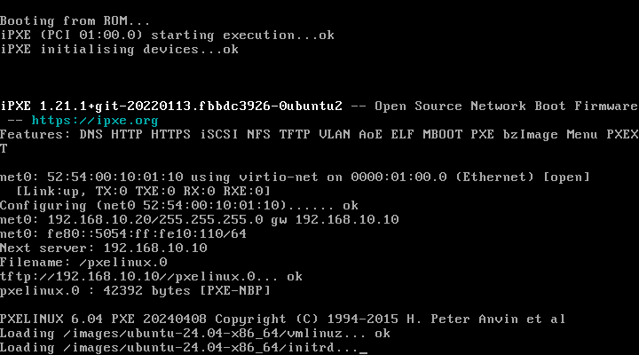

# Operations Manual — CMS High-Availability Infrastructure

> **Version:** 2.0  
> **Date:** June 2026

This manual describes the procedures to deploy, administer, and maintain the WordPress CMS high-availability infrastructure. The solution is optimised to run on a KVM hypervisor host under physical memory constraints (~27 GB RAM).

---

## Table of Contents

1. [Prerequisites](#1-prerequisites)
2. [Deployment Procedure (Batch Mode)](#2-deployment-procedure-batch-mode)
3. [Deployment Verification](#3-deployment-verification)
4. [Monitoring and Metrics](#4-monitoring-and-metrics)
5. [Scaling and Node Expansion](#5-scaling-and-node-expansion)
6. [Maintenance and Backups](#6-maintenance-and-backups)
7. [Failover and Disaster Recovery](#7-failover-and-disaster-recovery)
8. [Lab Resume Procedure](#8-lab-resume-procedure)

---

## 1. Prerequisites

### 1.1 Hypervisor Host Hardware
*   **CPU**: Minimum 4 physical cores (recommended: 8+ vCPUs).
*   **RAM**: 27 GB physical limit in the lab environment.
*   **Disk**: Minimum 60 GB free in `/home` (VM disks are stored at `/home/$USER/vm_storage` to avoid filling the root partition).
*   **Network**: At least 1 interface with internet access for NAT.

### 1.2 Required Software on the Hypervisor
The physical host must have the KVM hypervisor and libvirt library installed:
```bash
sudo apt update
sudo apt install -y qemu-kvm libvirt-daemon-system virtinst bridge-utils
```
The user must belong to the `libvirt` group to manage VMs without direct root privileges:
```bash
sudo usermod -aG libvirt $USER
newgrp libvirt
```

---

## 2. Deployment Procedure (Batch Mode)

Due to the **27 GB RAM limit**, launching all 14 VMs simultaneously with the Ubuntu 24.04 installer's minimum requirements (3-4 GB per node) would cause the host to run out of memory (OOM). Therefore, the initial deployment is performed **interactively in batches**.

### Step 1: Provision the Jumpstart Node and Configure Cobbler
On the hypervisor terminal, run the main script to create virtual networks and install the central provisioning node (`jumpstart`):
```bash
# 1. Create networks and launch the jumpstart VM
bash scripts/00_init_vms.sh --jumpstart-only

# 2. Wait until Jumpstart is reachable via SSH
# (The script below verifies connectivity automatically)
```
Once Jumpstart is powered on and responds to ping/SSH, run the Cobbler and NFS setup script:
```bash
# 3. Configure Cobbler server, DHCP, and NFS
bash scripts/00_setup_cobbler.sh

# 4. Register client node templates and profiles in Cobbler
bash scripts/add_cobbler_nodes.sh
```

### Step 2: Sequential Installation and RAM Adjustment (Batches)

Run the interactive script that automates the creation and installation of client nodes in 5 sequential batches:
```bash
bash scripts/utils/install_by_batches.sh
```
**Instructions during execution:**
*   The script creates VMs for each batch with high RAM (3-4 GB) so the Ubuntu installer does not suffer OOM.
*   Once a batch's VMs finish installation and boot the OS for the first time, **press [ENTER]** in the script terminal.
*   The script will shut down the batch VMs, reduce their RAM to production profile (512 MB - 1024 MB), and restart them before moving to the next batch.

The following screenshot shows the automated PXE network installation process via Cobbler:




### Step 3: Service and Application Deployment
Once all VMs are installed, running, and RAM-reduced to optimal production values, run the final orchestrator to install Puppet, K3s cluster, Nginx load balancer, per-node firewalling, and DRBD replication:
```bash
./deploy_all.sh --skip-vm-create
```
This script handles:
1. Installing Puppet Agent and configuring the Puppet CA on all nodes.
2. Deploying the K3s HA cluster and registering nodes.
3. Launching WordPress and configuring Apache on the web frontend nodes.
4. Deploying Nginx as the load balancer.
5. Initialising DRBD replication for the MariaDB data directory.
6. Applying UFW firewall policies.
7. Installing and starting the monitoring stack.
8. Deploying the internal Certificate Authority (step-ca).

---

## 3. Deployment Verification

### 3.1 VM Status on the Hypervisor
```bash
virsh -c qemu:///system list --all
# You should see 14 active VMs (jumpstart, ufw-router, monitor, storage, masters, workers, lb, cms, hotdesks)
```

### 3.2 Network Connectivity and Isolation (DTE-to-DTE Tests)
1.  **Internal Connectivity**: `ping` from `internal-master1` (`192.168.10.11`) to `jumpstart` (`192.168.10.10`) → **Allowed** (0% loss).
2.  **Allowed Inter-VLAN Connectivity**: `ping` from `internal-master1` (`192.168.10.11`) to `main-lb` (`192.168.20.100`) → **Allowed** (routed).
3.  **Security Isolation (Main → Internal)**: `ping` from a hotdesk (`192.168.20.201`) to `internal-master1` (`192.168.10.11`) → **Denied/Blocked** by UFW on the router (100% loss).
4.  **Internet Access**: `ping -c 3 8.8.8.8` from any node → **Allowed** (NAT masqueraded by the router).

### 3.3 WordPress CMS Service Verification
Send an HTTPS request to the load balancer to verify the CMS is responding:
```bash
curl -sk https://192.168.20.100/ | grep -i "wordpress"
```

### 3.4 Full Infrastructure Health Check (`verify_all.sh`)
To perform a comprehensive, automated validation of all infrastructure phases, run the verification script on the hypervisor:
```bash
bash scripts/utils/verify_all.sh
```

Below is the expected output of a successful run where all services and configurations are operational:

```text
=========================================================
   CMS Infrastructure Verifier (Health Check)
=========================================================

[INFO] === Phase 00: VM and Network Status in Libvirt ===
[OK] VM jumpstart is: running
[OK] VM ufw-router is: running
[OK] VM internal-monitor is: running
[OK] VM internal-storage is: running
[OK] VM internal-master1 is: running
[OK] VM internal-master2 is: running
[OK] VM internal-worker1 is: running
[OK] VM internal-worker2 is: running
[OK] VM main-lb is: running
[OK] VM main-cms1 is: running
[OK] VM main-cms2 is: running
[OK] VM main-hotdesk1 is: running
[OK] Virtual network 'internal' is active
[OK] Virtual network 'main' is active

[INFO] === Phase 01: Cobbler Server on Jumpstart ===
[OK] SSH access to jumpstart (192.168.10.10) OK
[OK] Service cobblerd on jumpstart is active
[OK] Service apache2 on jumpstart is active
[OK] Service isc-dhcp-server on jumpstart is active
[OK] Service bind9 on jumpstart is active
[OK] Service tftpd-hpa on jumpstart is active
[OK] Cobbler has 13 registered systems (correct)

[INFO] === Phase 02: Puppet Server and Agents ===
[OK] Puppet Server is active on jumpstart
[OK] Puppet has 11 signed certificates (correct)
[OK] Puppet Agent active on internal-monitor (192.168.10.20)
[OK] Puppet Agent active on internal-master1 (192.168.10.11)
[OK] Puppet Agent active on internal-master2 (192.168.10.12)
[OK] Puppet Agent active on internal-worker1 (192.168.10.13)
[OK] Puppet Agent active on internal-worker2 (192.168.10.14)
[OK] Puppet Agent active on internal-storage (192.168.10.15)
[OK] Puppet Agent active on main-lb (192.168.20.100)
[OK] Puppet Agent active on main-cms1 (192.168.20.101)
[OK] Puppet Agent active on main-cms2 (192.168.20.102)

[INFO] === Phase 03: Nginx Load Balancer and WordPress Servers ===
[OK] Nginx Load Balancer active on main-lb (192.168.20.100)
[OK] SSL certificate exists on main-lb
[OK] Apache2 CMS active on 192.168.20.101
[OK] WordPress installed on 192.168.20.101
[OK] Apache2 CMS active on 192.168.20.102
[OK] WordPress installed on 192.168.20.102

[INFO] === Phase 04: K3s HA Cluster ===
[OK] kubectl operational on internal-master1
NAME               STATUS   ROLES                         AGE   VERSION
internal-master1   Ready    control-plane,master          22h   v1.27.4+k3s1
internal-master2   Ready    control-plane,master          22h   v1.27.4+k3s1
internal-worker1   Ready    <none>                        22h   v1.27.4+k3s1
internal-worker2   Ready    <none>                        22h   v1.27.4+k3s1
[OK] MariaDB pod in namespace cms is Running

[INFO] === Phase 05: Prometheus and Grafana ===
[OK] Service prometheus on monitor is active
[OK] Service grafana-server on monitor is active
[OK] node_exporter active on internal-monitor (192.168.10.20)
[OK] node_exporter active on internal-master1 (192.168.10.11)
[OK] node_exporter active on internal-master2 (192.168.10.12)
[OK] node_exporter active on internal-worker1 (192.168.10.13)
[OK] node_exporter active on internal-worker2 (192.168.10.14)
[OK] node_exporter active on internal-storage (192.168.10.15)
[OK] node_exporter active on main-lb (192.168.20.100)
[OK] node_exporter active on main-cms1 (192.168.20.101)
[OK] node_exporter active on main-cms2 (192.168.20.102)

[INFO] === Phase 06: UFW Firewall ===
[OK] UFW active on ufw-router
[OK] IP Forwarding enabled on ufw-router

[INFO] === Phase 07: DRBD Replication ===
[OK] DRBD resource cms_data is active:
Connection State: Connected
Role: Primary/Secondary
Disk State: UpToDate/UpToDate
[OK] DRBD filesystem mounted at /mnt/data/mariadb on internal-master1

=========================================================
            Verification Complete
=========================================================

════════════════════════════════════
  ✔ All checks passed
```

---

## 4. Monitoring and Metrics

The `internal-monitor` node centralises metrics collection and visualisation:
*   **Prometheus**: `http://192.168.10.20:9090` (verify target status at `/targets`).
*   **Grafana**: `http://192.168.10.20:3000` (User: `admin` / Password: `admin`).
*   **Alertmanager**: `http://192.168.10.20:9093` (alert routing and notification).

### Critical Monitored Metrics
*   **Infrastructure**: CPU usage (`node_cpu_seconds_total`), available memory (`node_memory_MemAvailable_bytes`), disk usage (`node_filesystem_avail_bytes`), and network traffic (`node_network_receive_bytes_total`).
*   **Services**: Nginx active connections (`nginx_connections_active`), Apache workers (`apache_workers`), MariaDB queries (`mysql_global_status_queries`), and K3s pod replicas.

---

## 5. Scaling and Node Expansion

### 5.1 Adding a New Hot-desk Workstation (e.g., `main-hotdesk4`)
1.  **Register in Cobbler (on the `jumpstart` VM)**:
    ```bash
    cobbler system add \
      --name=main-hotdesk4 \
      --hostname=main-hotdesk4.main.local \
      --mac=52:54:00:10:02:cc \
      --ip-address=192.168.20.204 \
      --profile=ubuntu-24.04-x86_64 \
      --interface=ens3 \
      --static=1
    cobbler sync
    ```
2.  **Create and start the VM on the hypervisor**:
    ```bash
    sudo virt-install \
      --connect qemu:///system \
      --name=main-hotdesk4 \
      --ram=768 --vcpus=1 \
      --disk path=/home/$USER/vm_storage/main-hotdesk4.qcow2,size=3,format=qcow2,bus=virtio \
      --network network=main,mac="52:54:00:10:02:cc",model=virtio \
      --pxe \
      --boot network,hd \
      --os-variant=ubuntu24.04 \
      --noautoconsole --wait=0
    ```
3.  The VM will PXE boot, install unattended, and self-configure through Puppet.

---

## 6. Maintenance and Backups

### 6.1 Database Backups (MariaDB)

**Automated backups** run daily at 02:00 UTC via a Kubernetes CronJob (`kubernetes/mariadb-backup-cronjob.yaml`). Backups are stored at `/mnt/data/mariadb-backups` on the DRBD-replicated volume with 7-day retention.

To perform a manual backup from the internal network:
```bash
mysqldump -h 192.168.10.11 -P 30306 -u root -pmysqlrootpass wordpress | gzip > backup_wordpress.sql.gz
```

### 6.2 WordPress File Backup
Back up the `/var/www/html/` directory on the frontend nodes:
```bash
tar -czf wp-files-backup.tar.gz /var/www/html/
```

---

## 7. Failover and Disaster Recovery

### 7.1 Master 1 Failure (DRBD/K3s Primary)

> **Note (June 2026 update):** The MariaDB data directory (`/mnt/data/mariadb`) resides on the **local filesystem of `internal-master1`**, not directly on the DRBD device. This decision was made to avoid incompatibilities between InnoDB and the DRBD+qcow2 virtual block backend under `io_uring`. The DRBD resource (`cms_data`) remains active as a replication layer, but the mount point is not required for MariaDB operation.

If `internal-master1` goes down completely, the MariaDB pod will enter `Unknown` state. Manual recovery steps:
```bash
# 1. Check cluster status from master2
ssh root@192.168.10.12 'kubectl get nodes; kubectl get pods -n cms'

# 2. Force-delete the zombie pod
ssh root@192.168.10.12 'kubectl delete pod mariadb-0 -n cms --force --grace-period=0'

# 3. If MariaDB does not start on master2, promote DRBD there and migrate the PV
# (requires manual intervention — see full procedure in section 8)
```

### 7.2 Jumpstart Node Shutdown
Once the entire infrastructure is deployed, the `jumpstart` node can be safely shut down to free CPU/RAM resources on the physical server:
```bash
virsh -c qemu:///system shutdown jumpstart
```
The CMS infrastructure (WordPress, Nginx, MariaDB, K3s, Monitoring) will continue operating normally without depending on the provisioning server.

> **Important:** If `jumpstart` is shut down, the internal NTP server becomes unavailable. Node clocks may drift if they remain powered off for extended periods. Restart it before resuming the lab to ensure clock synchronisation.

### 7.3 Automated Failover Testing
Run the chaos engineering test suite to validate HA behaviour:
```bash
bash scripts/utils/test_failover.sh
```
This tests DRBD master failover, CMS frontend failover, and K3s worker failover with timing metrics.

---

## 8. Lab Resume Procedure

This section describes the procedure to **resume the lab** when VMs have been paused (`virsh suspend`) or shut down (`virsh shutdown` / `shut off`). All configurations in this section were applied permanently on **10 June 2026** and activate automatically on future boots without manual intervention.

### 8.1 Quick Procedure (automated script)

From the hypervisor server, run in order:

```bash
# 1. Start all VMs (paused → resume, stopped → start)
bash scripts/start_all_vms.sh

# 2. Wait ~60s for K3s nodes to become ready, then repair the cluster
bash scripts/utils/repair_paused_kubernetes.sh

# 3. Verify full infrastructure status
bash scripts/utils/verify_all.sh
```

### 8.2 Detailed Procedure (step-by-step)

#### Step 1 — Resume Paused VMs
```bash
# Resume all paused VMs at once
for vm in ufw-router jumpstart internal-monitor main-lb main-cms1 main-cms2 main-hotdesk1; do
  sudo virsh resume "$vm" 2>/dev/null && echo "OK: $vm"
done
```

#### Step 2 — Start Stopped VMs (K3s nodes)
```bash
# Order matters: masters first, then workers and storage
for vm in internal-master1 internal-master2 internal-storage internal-worker1 internal-worker2; do
  sudo virsh start "$vm" && sleep 6
done
```

#### Step 3 — Repair K3s Cluster After Extended Pause
```bash
bash scripts/utils/repair_paused_kubernetes.sh
```
This script: (1) synchronises clocks on all nodes, (2) cleans up stale K3s processes, (3) restarts K3s on masters and workers in parallel to recover etcd quorum, (4) verifies all 4 nodes reach `Ready` state.

#### Step 4 — Verify MariaDB
```bash
# The pod should reach 1/1 Running within ~2 minutes
ssh root@192.168.10.11 'kubectl get pod mariadb-0 -n cms -w'
```

If MariaDB enters `CrashLoopBackOff`, see section §8.4.

### 8.3 Permanent Boot-time Configurations

The following configurations were installed permanently and activate automatically on every boot without manual intervention:

#### a) `drbd-cms-primary.service` (on `internal-master1`)

Location: `/etc/systemd/system/drbd-cms-primary.service`

```ini
[Unit]
Description=Promote DRBD cms_data to Primary on master1
After=drbd.service network-online.target
Wants=drbd.service network-online.target
Before=k3s.service

[Service]
Type=oneshot
RemainAfterExit=yes
ExecStart=/bin/bash -c "drbdadm up all 2>/dev/null; sleep 3; drbdadm primary cms_data 2>/dev/null || true"
ExecStartPost=/bin/bash -c "drbdadm status 2>/dev/null || true"

[Install]
WantedBy=multi-user.target
```

**Effect:** Ensures DRBD reaches `Primary/Secondary UpToDate` state before K3s attempts to schedule pods.

```bash
# Verify the service status
systemctl status drbd-cms-primary.service
```

#### b) MariaDB Data Directory Guarantee (`tmpfiles.d`)

Location: `/etc/tmpfiles.d/mariadb-datadir.conf` on `internal-master1`

```
d /mnt/data          0755 root root -
d /mnt/data/mariadb  0755 999  999  -
```

**Effect:** The directory `/mnt/data/mariadb` (owner `mysql` UID=999) is automatically created on every boot even if the system loses it.

#### c) Internal NTP — All Nodes Synchronise to Jumpstart

All cluster nodes use `192.168.10.10` (jumpstart) as their primary NTP server.
Configuration applied in `/etc/chrony/chrony.conf` on each node:

```
server 192.168.10.10 iburst prefer
makestep 1.0 -1
```

`makestep 1.0 -1` forces an **immediate** clock correction upon resuming from pause, instead of the default gradual slew. This prevents TLS authentication and etcd failures caused by clock skew.

On `jumpstart` (`/etc/chrony/chrony.conf`):
```
allow 192.168.10.0/24
allow 192.168.20.0/24
local stratum 8
```

#### d) MariaDB ConfigMap — InnoDB without `io_uring` (in K3s)

An incompatibility was detected between InnoDB and the `io_uring` I/O backend on DRBD+qcow2 virtual block devices, which corrupted the `ibdata1` file during initialisation. A permanent ConfigMap was applied in the `cms` namespace:

```yaml
apiVersion: v1
kind: ConfigMap
metadata:
  name: mariadb-config
  namespace: cms
data:
  custom.cnf: |
    [mysqld]
    innodb_use_native_aio=0
    innodb_flush_method=fsync
    innodb_flush_log_at_trx_commit=2
```

Mounted in the StatefulSet as `/etc/mysql/conf.d/custom.cnf`.

```bash
# Verify the ConfigMap exists
ssh root@192.168.10.11 'kubectl get configmap mariadb-config -n cms'
```

### 8.4 Troubleshooting Common Issues After Boot

#### MariaDB in `CrashLoopBackOff` with InnoDB Error

Symptom in logs (`kubectl logs mariadb-0 -n cms`):
```
[ERROR] InnoDB: The data file './ibdata1' has the wrong space ID.
[ERROR] InnoDB: Plugin initialization aborted with error Data structure corruption
```

Cause: the data directory contains files from an incomplete initialisation (the process was interrupted before InnoDB wrote the `ibdata1` header).

Solution:
```bash
# 1. On internal-master1, clean up corrupted data
ssh root@192.168.10.11
rm -rf /mnt/data/mariadb/*
chown 999:999 /mnt/data/mariadb

# 2. Force pod recreation
kubectl delete pod mariadb-0 -n cms --force --grace-period=0

# 3. Wait for clean reinitialisation (~2 min)
kubectl get pod mariadb-0 -n cms -w
```

After reinitialisation, recreate the WordPress database:
```bash
CID=$(crictl ps 2>/dev/null | grep mariadb | awk "{print \$1}" | head -1)
crictl exec $CID mysql -uroot -pmysqlrootpass -e "CREATE DATABASE IF NOT EXISTS wordpress CHARACTER SET utf8mb4;"
crictl exec $CID mysql -uroot -pmysqlrootpass -e "CREATE USER IF NOT EXISTS 'wp_user'@'%' IDENTIFIED BY 'WpS3cur3P4ss!';"
crictl exec $CID mysql -uroot -pmysqlrootpass -e "GRANT ALL PRIVILEGES ON wordpress.* TO 'wp_user'@'%'; FLUSH PRIVILEGES;"
```

#### K3s Pods in `Unknown` State After Boot

Symptom: `kubectl get pods -A` shows pods in `Unknown` on nodes that were powered off.

Solution: these are zombie pods from the previous state. K3s cleans them automatically within ~5 minutes, or they can be force-deleted:
```bash
ssh root@192.168.10.11 \
  'kubectl get pods -A --field-selector=status.phase=Unknown -o json | \
   python3 -c "import json,sys,subprocess; [subprocess.run([\"kubectl\",\"delete\",\"pod\",\"-n\",i[\"metadata\"][\"namespace\"],i[\"metadata\"][\"name\"],\"--force\",\"--grace-period=0\"]) for i in json.load(sys.stdin)[\"items\"]]"'
```

#### Missing `rancher/mirrored-pause` Image on a Node

Symptom: `FailedCreatePodSandBox` due to missing pause image on a node that was powered off.

Solution: export from a node that has it (e.g., master2) and import:
```bash
# On the hypervisor
source ~/scripts/config.sh
scp $SSH_OPTS root@$MASTER2_IP:/tmp/pause-3.6.tar /tmp/pause-3.6.tar 2>/dev/null || \
  ssh $SSH_OPTS root@$MASTER2_IP 'ctr -n k8s.io images export /tmp/pause-3.6.tar docker.io/rancher/mirrored-pause:3.6' && \
  scp $SSH_OPTS root@$MASTER2_IP:/tmp/pause-3.6.tar /tmp/pause-3.6.tar

# Import on the affected node (example: master1)
scp $SSH_OPTS /tmp/pause-3.6.tar root@$MASTER1_IP:/tmp/pause-3.6.tar
ssh $SSH_OPTS root@$MASTER1_IP 'ctr -n k8s.io images import /tmp/pause-3.6.tar'
```
