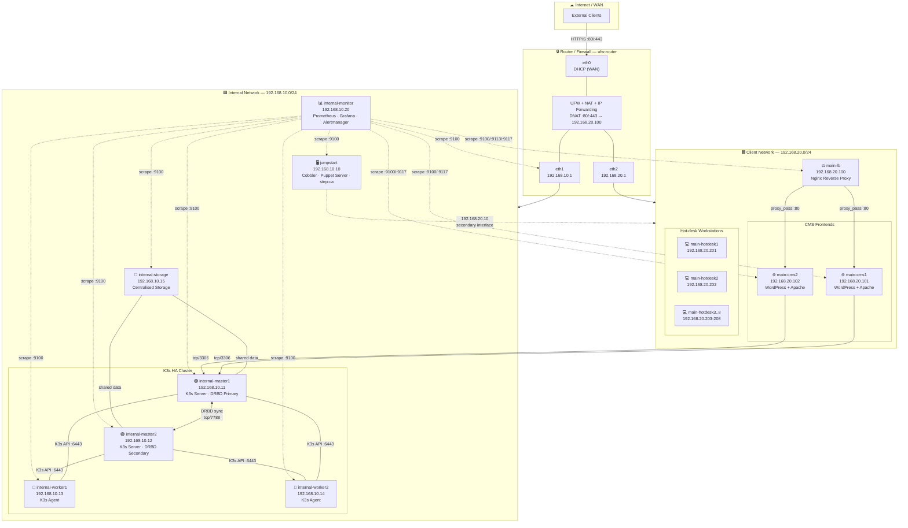
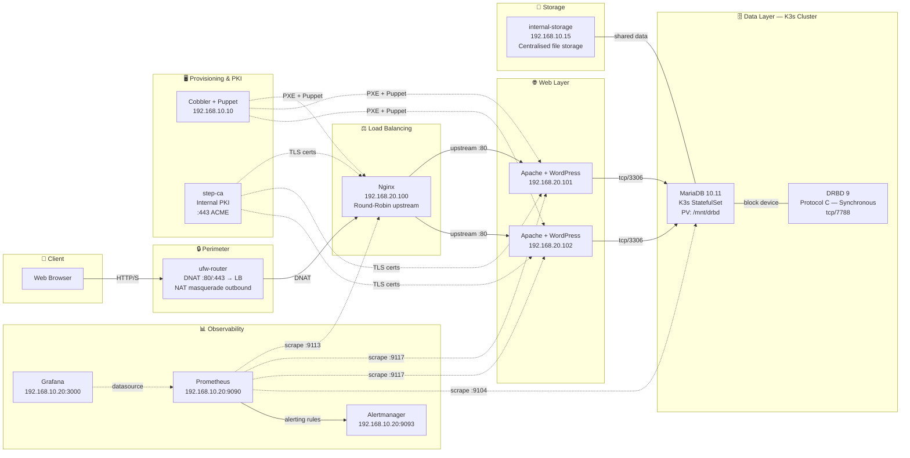

# Network Architecture Diagrams — CMS Infrastructure

This document contains the technical architecture diagrams for the CMS high-availability infrastructure, rendered with Mermaid.

---

## 1. Complete Network Topology

Diagram showing the physical and logical network segmentation, including all nodes, their IP addresses, and inter-network connections.

### Legend

| Symbol | Meaning |
|:-------|:--------|
| Solid line (`→`) | Data traffic / active connection |
| Dashed line (`-..->`) | Management / monitoring traffic |
| `🔒` | Router / firewall |
| `🖥` | Provisioning server (Cobbler · Puppet · step-ca) |
| `⚖` | Load balancer |
| `🟢` | K3s master node (DRBD) |
| `🔵` | K3s worker node |
| `💾` | Storage node |
| `📊` | Monitoring node (Prometheus · Grafana · Alertmanager) |
| `🌐` | CMS frontend (WordPress + Apache) |
| `💻` | Hot-desk workstation |
| `:9100` | node_exporter |
| `:9113` | nginx_exporter |
| `:9117` | apache_exporter |

---

## 2. Service Architecture

Diagram showing the traffic flow from external client to database, including the monitoring and provisioning layers.

### HTTP Traffic Flow

1. The **client** sends an HTTP/S request to the router's public IP.
2. The **router (UFW)** applies DNAT to redirect traffic on ports 80/443 to the load balancer `main-lb` (192.168.20.100).
3. **Nginx** distributes the request between `main-cms1` and `main-cms2` using round-robin.
4. The **Apache + WordPress** frontend processes the PHP request and queries **MariaDB** in the K3s cluster.
5. **DRBD** maintains synchronous replication of MariaDB data between `internal-master1` and `internal-master2`.

### Monitoring Flow

- **Prometheus** (192.168.10.20:9090) performs periodic scraping (every 15s) of all exporters.
- **Grafana** (192.168.10.20:3000) consumes Prometheus as a datasource and renders operational dashboards.
- **Alertmanager** (192.168.10.20:9093) routes alerts based on severity to configured webhook receivers.

---

## 3. Deployment Sequence

Diagram showing the execution order of deployment scripts when running the solution.

```mermaid
graph TD
    START(["▶ Start Deployment<br/>deploy_all.sh"])

    subgraph VM_PROVISION["🖥 VM Provisioning"]
        STEP00A["Step 00a · Create networks + Jumpstart VM<br/>00_init_vms.sh --jumpstart-only"]
        WAIT_JS["⏳ Wait for Jumpstart SSH"]
        STEP01["Step 01 · Install Cobbler on Jumpstart<br/>01_setup_cobbler.sh"]
        STEP015["Step 01.5 · Register all nodes in Cobbler<br/>02_register_cobbler_nodes.sh"]
        STEP00B["Step 00b · Batch PXE install all client VMs<br/>install_by_batches.sh"]
        WAIT_NODES["⏳ Wait for all VMs SSH"]
        STEP018["Step 01.8 · Repair SSH keys + Puppet CA<br/>03_repair_ssh_puppet.sh"]
    end

    subgraph CONFIG_MGMT["⚙ Configuration Management"]
        STEP02["Step 02 · Puppet Server + Agent convergence<br/>04_setup_puppet.sh<br/>(includes hot-desk provisioning)"]
    end

    subgraph HA_INFRA["🔧 HA Infrastructure"]
        STEP03["Step 03 · DRBD HA block replication<br/>05_setup_drbd.sh"]
        STEP04["Step 04 · K3s HA cluster + MariaDB StatefulSet<br/>06_setup_kubernetes.sh"]
        STEP05["Step 05 · Nginx LB + Apache WordPress frontends<br/>07_setup_nginx_wordpress.sh"]
    end

    subgraph OBSERVE["📊 Observability"]
        STEP06["Step 06 · Prometheus + Grafana + Alertmanager<br/>08_setup_monitoring.sh"]
    end

    subgraph SECURITY["🔒 Security"]
        STEP07["Step 07 · UFW perimeter + per-node firewall<br/>09_setup_ufw.sh"]
        STEP08["Step 08 · Internal CA (step-ca) + TLS certs<br/>10_setup_internal_ca.sh"]
    end

    TRAFFIC["Step 09 · Traffic mix + load testing<br/>11_traffic_mix.sh"]
    END(["✅ Deployment Complete"])

    START --> STEP00A
    STEP00A --> WAIT_JS
    WAIT_JS --> STEP01
    STEP01 --> STEP015
    STEP015 --> STEP00B
    STEP00B --> WAIT_NODES
    WAIT_NODES --> STEP018
    STEP018 --> STEP02
    STEP02 --> STEP03
    STEP03 --> STEP04
    STEP04 --> STEP05
    STEP05 --> STEP06
    STEP06 --> STEP07
    STEP07 --> STEP08
    STEP08 --> END
    END -.->|"optional"| TRAFFIC
```

### Deployment Sequence Notes

- The initial deployment requires launching the **Jumpstart node (Phase 00a)** first, as it serves as the provisioning server for all other clients.
- **Phase 00b** is performed **sequentially in batches** (`install_by_batches.sh`) to prevent the host's physical memory (27 GB) from being exhausted by the OS installers' initial requirements.
- The `deploy_all.sh --skip-vm-create` command orchestrates all phases from **Phase 01.8** onwards, once all client VMs are installed and running with optimised RAM.
- Configuration phases (Puppet, DRBD, K3s, Nginx, UFW, Monitoring, and Internal CA) are **strictly sequential** due to mutual service dependencies.
