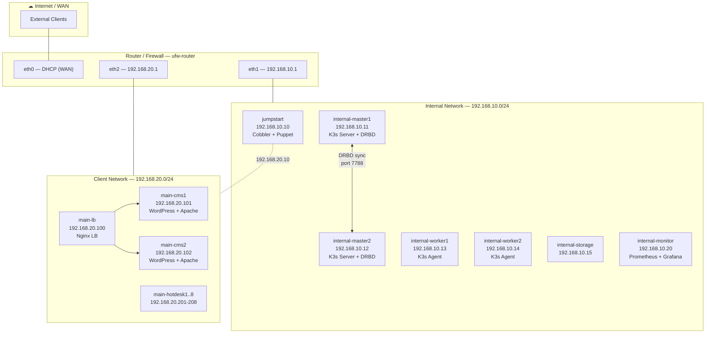

# Architecture Plan — CMS High-Availability Infrastructure

## Table of Contents

1. [Overview](#overview)
2. [Node Inventory](#node-inventory)
3. [Technology Stack](#technology-stack)
4. [Deployment Phases](#deployment-phases)
5. [Network Diagram](#network-diagram)
6. [Variables & Configuration](#variables--configuration)

---

## Overview

This project covers the **fully automated design, implementation, and provisioning** of a high-availability IT infrastructure for hosting a Content Management System (**CMS**).

### Key Design Decisions

| Aspect | Decision | Rationale |
|:-------|:---------|:----------|
| **CMS** | WordPress 6.x | Industry-leading CMS with the largest plugin ecosystem and well-understood requirements |
| **Database** | MariaDB 10.11.x | Community fork of MySQL with proven WordPress compatibility, LTS support, and superior performance |
| **Web Server (Frontends)** | Apache 2.4.x + PHP 8.3.x | Native WordPress compatibility (`.htaccess`, `mod_rewrite`), mature module ecosystem |
| **Load Balancer** | Nginx 1.24.x | High-performance reverse proxy with minimal resource footprint and upstream health checks |
| **Container Orchestrator** | K3s v1.29.x | Lightweight Kubernetes distribution, ideal for resource-constrained environments |
| **Block Replication** | DRBD 9.x | Synchronous Protocol C replication ensuring zero data loss between master nodes |
| **Bare-metal Provisioning** | Cobbler 3.3.x | PXE + autoinstall for fully unattended Ubuntu deployment across all nodes |
| **Configuration Management** | Puppet 8.x | Declarative, idempotent configuration with an agent/server model |
| **Observability** | Prometheus 2.x + Grafana 11.x | Industry-standard monitoring stack with exporters for every service layer |
| **Firewall** | UFW | iptables abstraction layer — auditable, scriptable, and easy to maintain |

The network is segmented into two subnets (`internal` and `main`) connected by a UFW router/firewall. The Jumpstart node (Cobbler + Puppet Server) has dual-homed presence in both networks to provision all nodes.

The entire deployment is executed from a **single entry point**: `deploy_all.sh`.

---

## Node Inventory

### Router / Firewall

| Hostname | IP | Network | Role | RAM | Disk | MAC |
|:---------|:---|:--------|:-----|:----|:-----|:----|
| ufw-router | eth0: DHCP (WAN) | WAN | Perimeter router / firewall | 512 MB | 5 GB | (auto) |
| | eth1: 192.168.10.1 | internal | Internal network gateway | | | (auto) |
| | eth2: 192.168.20.1 | main | Client network gateway | | | (auto) |

### Jumpstart Node (dual/triple-homed)

| Hostname | IP | Network | Role | RAM | Disk | MAC |
|:---------|:---|:--------|:-----|:----|:-----|:----|
| jumpstart | 192.168.10.10 | internal | Cobbler + Puppet Server | 2048 MB | 30 GB | 52:54:00:10:00:01 |
| | 192.168.20.10 | main | (secondary interface) | | | 52:54:00:10:02:0a |
| | DHCP (WAN) | WAN | (optional interface for package downloads) | | | 52:54:00:10:00:09 |

### Internal Network (192.168.10.0/24)

| Hostname | IP | Network | Role | RAM | Disk | MAC |
|:---------|:---|:--------|:-----|:----|:-----|:----|
| internal-master1 | 192.168.10.11 | internal | K3s Server (master), DRBD Primary | 1024 MB | 8 GB + 3 GB (DRBD) | 52:54:00:10:01:11 |
| internal-master2 | 192.168.10.12 | internal | K3s Server (master), DRBD Secondary | 1024 MB | 8 GB + 3 GB (DRBD) | 52:54:00:10:01:12 |
| internal-worker1 | 192.168.10.13 | internal | K3s Agent (worker) | 768 MB | 8 GB | 52:54:00:10:01:13 |
| internal-worker2 | 192.168.10.14 | internal | K3s Agent (worker) | 768 MB | 8 GB | 52:54:00:10:01:14 |
| internal-storage | 192.168.10.15 | internal | Centralised storage server | 1024 MB | 8 GB | 52:54:00:10:01:15 |
| internal-monitor | 192.168.10.20 | internal | Prometheus + Grafana | 512 MB | 4 GB | 52:54:00:10:01:10 |

### Client Network (192.168.20.0/24)

| Hostname | IP | Network | Role | RAM | Disk | MAC |
|:---------|:---|:--------|:-----|:----|:-----|:----|
| main-lb | 192.168.20.100 | main | Load balancer (Nginx reverse proxy) | 512 MB | 4 GB | 52:54:00:10:02:64 |
| main-cms1 | 192.168.20.101 | main | CMS frontend (WordPress + Apache) | 512 MB | 4 GB | 52:54:00:10:02:65 |
| main-cms2 | 192.168.20.102 | main | CMS frontend (WordPress + Apache) | 512 MB | 4 GB | 52:54:00:10:02:66 |
| main-hotdesk1 | 192.168.20.201 | main | Hot-desk workstation (dynamic) | 768 MB | 3 GB | 52:54:00:10:02:c9 |
| main-hotdesk2 | 192.168.20.202 | main | Hot-desk workstation (dynamic) | 768 MB | 3 GB | 52:54:00:10:02:ca |
| main-hotdesk3 | 192.168.20.203 | main | Hot-desk workstation (dynamic) | 768 MB | 3 GB | 52:54:00:10:02:cb |
| ... | ... | ... | ... | ... | ... | ... |
| main-hotdesk8 | 192.168.20.208 | main | Hot-desk workstation (dynamic) | 512 MB | 3 GB | 52:54:00:10:02:d0 |

**Total:** 1 router + 1 jumpstart + 6 internal nodes + 3 fixed main nodes + N hot-desks (default 3, dynamically scalable up to 8).

---

## Technology Stack

| Technology | Version | Role in the Project |
|:-----------|:--------|:--------------------|
| **Cobbler** | 3.3.x | Zero-touch bare-metal provisioning (PXE + autoinstall) |
| **Puppet** | 8.x | Idempotent configuration management (server + agents) |
| **Nginx** | 1.24.x | Reverse proxy load balancing with health checks |
| **K3s** | v1.29.x | Lightweight Kubernetes HA clustering |
| **MariaDB** | 10.11.x | SQL database for WordPress (Kubernetes StatefulSet) |
| **WordPress** | 6.x | Content Management System (CMS) |
| **Apache** | 2.4.x | Web server for CMS frontends |
| **Prometheus** | 2.x | Infrastructure and service metrics collection |
| **Grafana** | 11.x | Metrics visualisation and operational dashboards |
| **UFW** | — | Network segmentation and per-node firewalling |
| **DRBD** | 9.x | High availability — synchronous block-level replication |

---

## Project Phases & Deployment Mapping

The project structure is split between the **Project Milestones** (which correspond to the design phases documented in `docs/phases/FASE-XX.md`) and the **Technical Execution Sequence** implemented by the `deploy_all.sh` orchestrator script.

### 1. Project Milestones (Design Phases)

| FASE | Project Milestone | Key Task | Documentation |
|:---:|:---|:---|:---|
| **00** | Diseño de Red y Direccionamiento | IP & MAC planning, VM specifications | [FASE 00](phases/FASE-00.md) |
| **01** | Nodo Jumpstart / Cobbler | Cobbler PXE server setup & autoinstall profiles | [FASE 01](phases/FASE-01.md) |
| **02** | Redundancia de Red | L2 Loop prevention with Spanning Tree (STP) | [FASE 02](phases/FASE-02.md) |
| **03** | Clúster HA y Base de Datos | DRBD block replication & K3s cluster database | [FASE 03](phases/FASE-03.md) |
| **04** | Enrutamiento y Securización L3 | Perimeter routing (UFW router) & NAT policies | [FASE 04](phases/FASE-04.md) |
| **05** | Frontales CMS y Balanceador | Nginx Load Balancer & Apache CMS frontends | [FASE 05](phases/FASE-05.md) |
| **06** | Firewalling Nodal (End-point Security) | Local firewall rules per node via UFW | [FASE 06](phases/FASE-06.md) |
| **07** | Monitorización de Infraestructura | Prometheus & node_exporter metrics scraping | [FASE 07](phases/FASE-07.md) |
| **08** | Monitorización de Servicios | Nginx, Apache, MariaDB exporters & Grafana | [FASE 08](phases/FASE-08.md) |
| **09** | Puestos Hot-desks | Automated workstation VM provisioning | [FASE 09](phases/FASE-09.md) |
| **10** | TrafficMix y Tests End-to-End | Automated load testing & verification checks | [FASE 10](phases/FASE-10.md) |
| **11** | Documentación Final | Project manuals, baseline & diagram validation | [FASE 11](phases/FASE-11.md) |

### 2. Technical Execution Sequence (`deploy_all.sh`)

When launching `./deploy_all.sh`, the orchestrator executes the automation scripts in a sequential, dependency-aware logical order:

| Step | Script | Description | Milestone Mapping |
|:---:|:---|:---|:---:|
| **00a** | `00_init_vms.sh --jumpstart-only` | Virtual networks creation and Jumpstart node provisioning | FASE 00 |
| **01** | `00_setup_cobbler.sh` | Cobbler configuration (PXE, DHCP, TFTP, DNS) on Jumpstart | FASE 01 |
| **01.5**| `add_cobbler_nodes.sh` | Registration of all target nodes and MAC bindings in Cobbler | FASE 01 |
| **00b** | `00_init_vms.sh --nodes-only` | Unattended PXE installation of all client nodes (e.g. via `scripts/utils/install_by_batches.sh`) | FASE 00 |
| **01.8**| `08_repair_ssh_puppet.sh` | Post-install SSH key sync & Puppet CA certificate repair | FASE 01 |
| **02** | `01_setup_puppet.sh` | Puppet Server deployment and Agent convergence | FASE 01, FASE 09 |
| **03** | `06_setup_drbd.sh` | DRBD HA block storage replication setup on master nodes | FASE 03 |
| **04** | `03_setup_kubernetes.sh` | K3s HA clustering & MariaDB deployment on DRBD storage | FASE 03 |
| **05** | `02_setup_nginx.sh` | Nginx Load Balancer and WordPress frontends configuration | FASE 05 |
| **06** | `04_setup_monitoring.sh` | Prometheus monitoring, exporters, Grafana & alerts | FASE 07, FASE 08 |
| **07** | `05_setup_ufw.sh` | Perimeter routing (router) & per-node firewall policies | FASE 04, FASE 06 |
| **08** | `09_setup_internal_ca.sh` | Step-CA PKI deployment, TLS cert issuance and trust sync | FASE 04 |

---

## Network Diagram

> For detailed topology, service architecture, and deployment sequence diagrams see [`RED_DIAGRAMA.md`](RED_DIAGRAMA.md).

---

## Variables and Configuration

Configurable parameters used throughout the deployment scripts:

### Network Addressing

| Variable | Value | Description |
|:---------|:------|:------------|
| `INTERNAL_NET` | `192.168.10.0/24` | Internal network CIDR |
| `MAIN_NET` | `192.168.20.0/24` | Client network CIDR |
| `GW_INTERNAL` | `192.168.10.1` | Internal network gateway (router eth1) |
| `GW_MAIN` | `192.168.20.1` | Client network gateway (router eth2) |
| `DNS_SERVER` | `192.168.10.10` | DNS server (Cobbler/dnsmasq) |

### Core Nodes

| Variable | Value | Description |
|:---------|:------|:------------|
| `JUMPSTART_IP` | `192.168.10.10` | Jumpstart node (Cobbler + Puppet) |
| `MASTER1_IP` | `192.168.10.11` | First K3s master node |
| `MASTER2_IP` | `192.168.10.12` | Second K3s master node |
| `WORKER1_IP` | `192.168.10.13` | First K3s worker node |
| `WORKER2_IP` | `192.168.10.14` | Second K3s worker node |
| `STORAGE_IP` | `192.168.10.15` | Storage node |
| `MONITOR_IP` | `192.168.10.20` | Monitoring node (Prometheus + Grafana) |
| `LB_IP` | `192.168.20.100` | Nginx load balancer |
| `CMS1_IP` | `192.168.20.101` | CMS frontend 1 |
| `CMS2_IP` | `192.168.20.102` | CMS frontend 2 |
| `ROUTER_IP` | `192.168.10.1` | Router internal interface |

### Services

| Variable | Value | Description |
|:---------|:------|:------------|
| `CMS_DOMAIN` | `cms.fake-enterprise.com` | CMS domain (resolved by internal DNS) |
| `GRAFANA_PORT` | `3000` | Grafana dashboard port |
| `PROMETHEUS_PORT` | `9090` | Prometheus API port |
| `NODE_EXPORTER_PORT` | `9100` | node_exporter port on each node |
| `DRBD_PORT` | `7788` | DRBD synchronisation port |
| `K3S_API_PORT` | `6443` | Kubernetes API server port |
| `MARIADB_PORT` | `3306` | MariaDB database port |

### Virtualisation

| Variable | Value | Description |
|:---------|:------|:------------|
| `VM_DIR` | `$HOME/vm_storage` | VM disk image storage directory |
| `OS_VARIANT` | `ubuntu24.04` | OS variant for `virt-install` |
